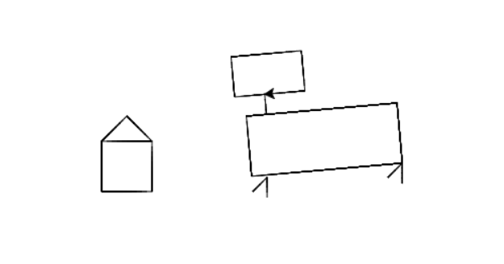

### Creative tasks with `turtle` and `input()`

#### 1. Ask some questions and make a story with the answers

```python
zodiak = input("Enter the character's zodiac sign ")
age = input("Enter the character's age ")
name = input("Enter the character's name ")
location = input("Where do you live ")
pet = input("What is your pet ")
food = input("What is your favourite food")

print("Hi! My name is " + name +" and I am " + zodiak + ". I am " + age + " years old." 
 + " I live in " + location + " I have a " + pet + " My favourite food is " + food)
      

```


#### 2. Come up with an idea of drawing and draw it with `turtle`. Please, use `variables`. I draw an animal

```python
import turtle

t = turtle.Turtle()

# Let's remember the commands for the turtle:
# right() - turn the turtle to the right;
# forward(), backward() - move the turtle forward or backward.

# up(), removes the pen from the canvas (disables drawing)
# You can use the down() command to enable drawing again.
# t. color ("red") - change the drawing color.
# t. speed(10) - change the drawing speed.

t.forward(50) 
t.left(90) 
t.forward(50) 
t.left(90) 
t.forward(50) 
t.left(90) 
t.forward(50) 
t.left(180) 

t.forward(50)

t.right(45)
t.forward(35.35533905932738)
t.right(90)
t.forward(35.35533905932738)

t.up()
t.right(45)
t.forward(50)

t.left(90)
t.forward(100)
t.down()


height = 60
lenght = 120
leg_angle = 45
leg_lenght = 20
t.left(leg_angle)
t.forward(leg_lenght)
t.right(180 - leg_angle)
t.forward(leg_lenght)
t.up()  # Stop drawing
t.backward(20)
t.left(90)
t.forward(lenght)
t.down()  # Starts drawing again
t.left(leg_angle)
t.forward(leg_lenght)
t.right(180 - leg_angle)
t.forward(leg_lenght)
t.backward(leg_lenght)
t.right(85)
t.forward(lenght + 30)
t.right(90)
t.forward(height)
t.right(90)
t.forward(lenght + 30)
t.right(90)
t.forward(height)

t.backward(height)
t.right(90)
t.forward(lenght + 10)
t.right(90)
t.forward(20)
t.left(90)
t.forward(30)
t.right(90)
t.forward(40)
t.right(90)
t.forward(70)
t.right(90)
t.forward(40)
t.right(90)
t.forward(40)
```

#### Result:



### Comments on a home task

#### 2nd Problem. Given a 3-digit number, print `sum of the digits`.

```python
num = int(input())  # int

# We want to get the digits and to count the sum
first = num // 100
second = (num // 10) % 10
last = num % 10
res = first + second + last
print(res)
```

#### 3rd Assignment

#### You are given an integer N – the number of seconds since midnight.

#### Write  a code that will determine how many full hours and minutes have passed since midnight.

**Firstly, we need to read the number that user entered, so we use `input()` function**:

```python
N = int(input("Enter the number of seconds"))
```

**To count the number of hours we need to know how many seconds in one hour, and to count the number of minutes we need to know how many seconds in one minute, let's store these numbers in `variables`**:

```python
seconds_in_minute = 60  # Num of seconds in a minute
second_in_hour = 3600  # Num of second in one hour
```

**As we know all the numbers, we need to calculate the result, we divide `N` by `number of seconds in one hour` to get hours and  `N` by `number of seconds in one minute` to get minutes.**

**We need to use `//` here to get integer part of the result, so we do:**

```python
hours = N // second_in_hour  # Counts num of hours
minutes = N // seconds_in_minute  # Counts num of minutes
print(hours, minutes)  # Prints the results
```

## Comments on the hometask  
**1. Draw a regular hexagon**  
As it is said in the assignment in a regular hexagon all angles are `120 degrees`, it means that we should rotate our turtle by `60 degrees` every time  
```python
import turtle

t = turtle.Turtle()


t.forward(100)
t.right(60)
t.forward(100)
t.right(60)
t.forward(100)
t.right(60)
t.forward(100)
t.right(60)
t.forward(100)
t.right(60)
t.forward(100)
t.right(60)
```  
**You are given a 3-digit number. Find the sum of all digits**  
To get the number we can use `input()` funtion  
```python
a = int(input())
```  
The furst digit would be `a // 100`  
The second digit is `(a // 10) % 10` 
The third digit is `a % 10`  
**You have to store all the digits in `variables` and then print the sum of those variables**   