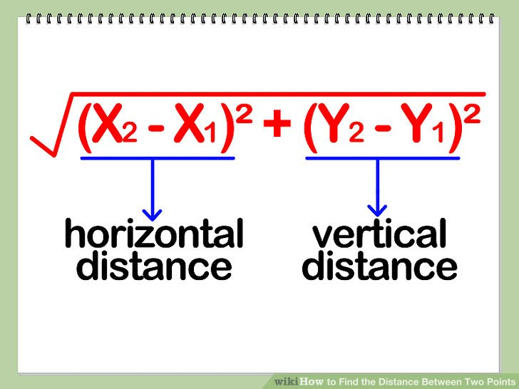

## Class assignments for `functions`  
  
### A simple `function` to draw a rectangle  
```python
from turtle import *
def rectangle():
    t.pendown()
    for i in range(4):
        t.forward(100)
        t.left(90)

t = Turtle()
rectangle()
```  
  
### Now, we will use this `function` to draw a fild with rectangles  
```python
from turtle import *
def rectangle():
    t.pendown()
    for i in range(0,4,1):
        t.forward(50)
        t.left(90)
    t.forward(50)

t = Turtle()
for j in range(3):
    t.penup()
    t.goto(0,-50 * j)
    for i in range(3):
        rectangle()
```  
  
### Let's write a function to count the distance between 2 points  
### `The formula`, if you have coordinates of 2 points: (x1, y1) and (x2, y2):  
  

### We will use this `formula` in the code, `sqrt` is a square root :):  
### Look that this function `returns!` a result
```python
from math import sqrt

def getDistance(x1,y1,x2,y2):
    #Enter your code here
    a = (x2 - x1) ** 2
    b = (y2 - y1) ** 2
    result = sqrt(a + b)
    return result

x1 = int(input("Enter the x coordinate of the 1st point"))
y1 = int(input("Enter the y coordinate of the 1st point"))
x2 = int(input("Enter the x coordinate of the second point"))
y2 = int(input("Enter the y coordinate of the second point"))
distance = getDistance(x1,y1,x2,y2)
print(distance)
```

### Finaly, we will write a simple function to print all the elements from the `list`  
```python
def printLine(list):
    #Enter your code here
    for element in list:
        print(element)
    
        
list = [1,4,7,5, 15]
printLine(list)
```


## Home Task for `functions`  

### 1. It is an `additional task from the lesson`. Make a function to check whether the number is prime or not :)  
```python
def isPrime(N):
    # We go from 2 to N - 1
    for i in range(2, N):
        # N divides by i with no remainder
        if N % i == 0:
            # Number is not prime
            return 0
            break
    # Number is not prime after we checked all the numbers
    return 1
```  

### 2. Function for making a circle  
```python
def circle():
    t = Turtle()
    for i in range(0,20,1):
        t.forward(5)
        t.left(18)
```  

### 3. Function for finding the maximum element in the list  
```python
def printMax(list):
    
    # we will start with the first element in the list
    maximum = list[0]
    for element in list:
        # If we found the elemnt which is bigger than a current maximum
        if element > maximum:
            maximum = element
    print(maximum)
```