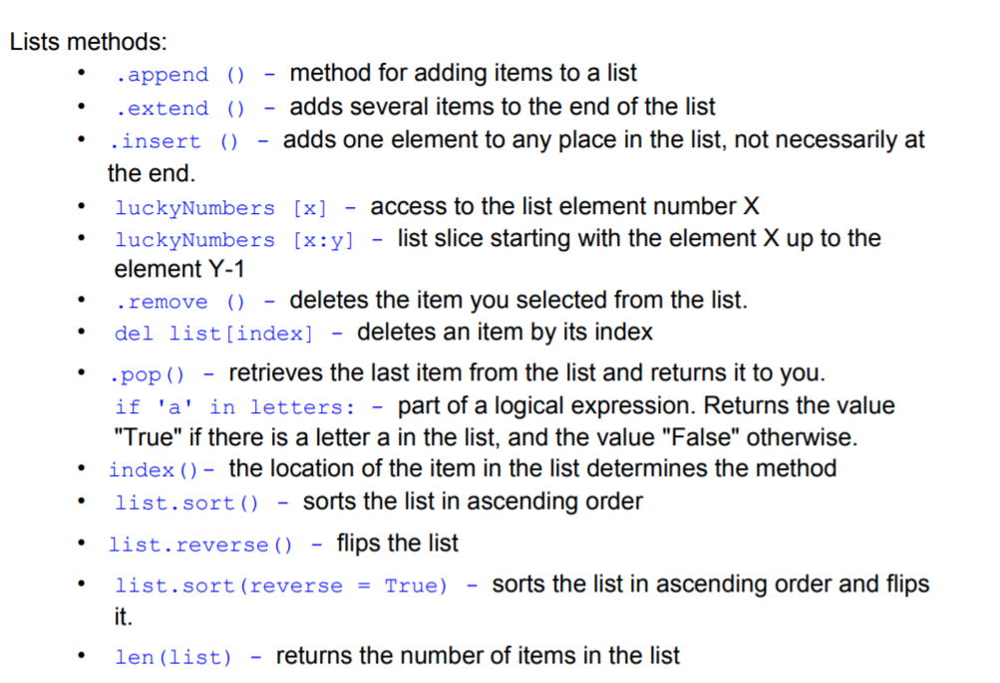

### Operations with the lists



### You can get the `slice` from the list which is a `sequesce of elements from the list`  
**To get the slice from the list you should do:**  
```python
list_name[a:b]
```
**This would give you the elements with the indexes from `a` to `b`, but `b` is not included**  
**Example of slices:**  
```python
l = [1, 3, 10, 5, 6]

print(l[1])
print(l[0:3])  # slice
print(l[1:3])

print(type(l[0:3]))

print(l[:4])
print(l[2:])
print(l[:])
```  
**Assignment: you need to get all the "Diamonds" from the list**  
Code:  
```python
mine = ["Bomb", "Bomb",  "Diamonds",  " Diamonds",  " Diamonds", "Bomb", "Bomb", "Bomb"]

print(mine[2:5])
```  
**We can put lists inside of other lists and we would get a 2-dimension list**  
```python
joeMarks = [10, 25, 11, 22]
tomMarks = [12, 32, 40, 32]
bethMarks = [3, 10, 15, 24]

marks = [joeMarks, tomMarks, bethMarks]
print(marks)
print(marks[1][1])
```  
**Assignment: to count the sum of the row and of the collumn:**  
```python
classMarks = [ [55,63,77,81], [65,61,67,72], [97,95,92,88] ]
print(classMarks)
print(classMarks[0][3])
print((classMarks[0][0] + classMarks[1][0] + classMarks[2][0]) / 3)
print(classMarks[2][0] + classMarks[2][1] + classMarks[2][2] + classMarks[2][3])
```  
**That is how we can create a 2-dimensional list, which is actually a table**  
```python
console = [[10426448, 12750000, 1448665], 
            [520000, 1060000, 870000], 
            [57000000, 4540000000, 1160000000]]
```
**Let's add a row to the table**  
```python
console = [[10426448, 12750000, 1448665], 
            [520000, 1060000, 870000], 
            [57000000, 4540000000, 1160000000]]
            
print(console)
console.append([19000000, 490000000, 320000000])
```  
**For the first home assignment you can try to go with:**  
```python 
u1 = [3, 3, 3]
u2 = [2, 2, 2]
u3 = [3, 2, 'no']
u4 = [3, 3, 'no']

score = [u1, u2, u3, u4]

print(score[1][2])  # gets a particular score
```
**To count the mean, it is easy to use the formula:**
```python
print((score[0][0] + score[0][1] + score[0][2])/3)
```
**And to count the sum of all numbers you can go with a for loop and get through each row and then inside of each row go through the elements which are inside of it:**  
```python
summ = 0
for i in score:
    for j in i:
        if j != 'no':
            summ += j
print(summ)
```

**2nd Assignment from the hometask**  
**To create the journal and mark it all with `"no activity"`, we firstly go with**  
```python
Mon = []
Tue = []
Wed = []
Th = []
Fr = []
Sat = []
Sun = []
journal = [Mon, Tue, Wed, Th, Fr, Sat, Sun]

for i in range(0, 7):
    journal[i].append('no activity')
```  

**Then we need to get the commands from the user, we can use `while` loop and `if` statements for it**  
```python
while(True):
    line = input('Enter a command')
    if(line == 'print'):
        print(journal)
    elif(line == 'edit'):
        line2 = input('What activity do you want to add?')
        line3 = int(input('what day of the week?  0 - 6'))
        # Here you need to edit the journal, please, do it
```  
**At the end, you would need to print the journal :)**  

It is, basically, similar to the previous one, but we need to add some more commands  

```python
while(True):
    line = input('Enter a command')
    if(line == 'print'):
        print(journal)
    elif(line == 'edit'):
        line2 = input('What activity do you want to add?')
        line3 = int(input('what day of the week? 0 - 6'))
        line4 = int(input('what time of day? 0 - 2'))
        journal[line3][line4] = line2
    elif(line == 'delete'):
        line3 = int(input('what day of the week to delete? 0 - 6'))
        line4 = int(input('what time of day to delete? 0 - 2'))
        # Here you need to put on the day and on the time the value "no activity"
        # Write your code here
    elif(line == 'check'):
        line3 = int(input('what day of the week? 0 - 6'))
        line4 = int(input('what time of day? 0 - 2'))
        ## Print the journal on the day and on the time here :)
    elif(line == 'help'):
        print('List of commands: edit, delete, check')
```
**At the end, you would need to print the journal :)**  