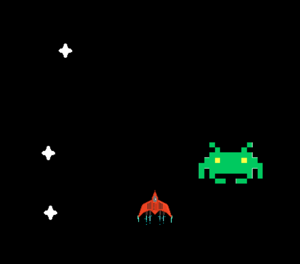

# Space Invaders Game  

### The game is going to look like:  


### Firstly, we will do the basic template of the game:  
```python
import pygame
import random

# Parameters
WIDTH = 500
HEIGHT = 500
FPS = 60

# Colours
BLACK = (0,0,0)
WHITE = (255,255,255)
RED = (255,0,0)
BLUE = (0,0,255)

# Initializing
pygame.init()
screen = pygame.display.set_mode((WIDTH,HEIGHT))
clock = pygame.time.Clock()

# Time for the enemies
lastTime = 0
currentTime = 0

# Template of the game:
moving = ''
running = True
while running:
    for i in pygame.event.get():
        if i.type == pygame.QUIT:
            running = False
    
    pygame.display.update()
    clock.tick(FPS)
pygame.quit()
```  

### Next, let's add some logic for the movement  
```python
import pygame
import random

# Parameters
WIDTH = 500
HEIGHT = 500
FPS = 60

# Colours
BLACK = (0,0,0)
WHITE = (255,255,255)
RED = (255,0,0)
BLUE = (0,0,255)

# Initializing
pygame.init()
screen = pygame.display.set_mode((WIDTH,HEIGHT))
clock = pygame.time.Clock()

# Time for the enemies
lastTime = 0
currentTime = 0

# Parameters of the hero
x = WIDTH // 2
y = HEIGHT // 2
hero = pygame.Rect(x, y, 60, 50)
heroImg = pygame.image.load('razorinv.png')

# Template of the game:
moving = ''
running = True
while running:
    for i in pygame.event.get():
        if i.type == pygame.QUIT:
            running = False
        
        # Handles different keys
        if i.type == pygame.KEYDOWN:
            if i.key == pygame.K_LEFT:
                moving = 'LEFT'
            if i.key == pygame.K_RIGHT:
                moving = 'RIGHT'
            if i.key == pygame.K_UP:
                moving = 'UP'
            if i.key == pygame.K_DOWN:
                moving = 'DOWN'
            
                
        # Handles a release of the key
        if i.type == pygame.KEYUP:
            if i.key == pygame.K_LEFT or i.key == pygame.K_RIGHT or i.key == pygame.K_UP or i.key == pygame.K_DOWN:
                moving = 'STOP'
    
    # Moving the ship
    if moving == 'LEFT' and hero.left > 0:
        hero.left -= 5
    if moving == 'RIGHT' and hero.right < WIDTH:
        hero.left += 5
    if moving == 'UP' and hero.top > 0:
        hero.top -= 5
    if moving == 'DOWN' and hero.bottom < HEIGHT:
        hero.top += 5
        
    # Draws the image of the ship
    screen.blit(heroImg, (hero.left, hero.top))
    
    pygame.display.update()
    clock.tick(FPS)
pygame.quit()
```  

### Now, we will make the ship shooting :)  
```python 
import pygame
import random

# Parameters
WIDTH = 500
HEIGHT = 500
FPS = 60

# Colours
BLACK = (0,0,0)
WHITE = (255,255,255)
RED = (255,0,0)
BLUE = (0,0,255)

# Initializing
pygame.init()
screen = pygame.display.set_mode((WIDTH,HEIGHT))
clock = pygame.time.Clock()

# Time for the enemies
lastTime = 0
currentTime = 0

# Parameters of the hero
x = WIDTH // 2
y = HEIGHT // 2
hero = pygame.Rect(x, y, 60, 50)
heroImg = pygame.image.load('razorinv.png')

# Parameters of the bullets
wb = 2
hb = 5
bulletImg = pygame.image.load("bullet.png")
bullets = []
isShot = False

# Template of the game:
moving = ''
running = True
while running:
    for i in pygame.event.get():
        if i.type == pygame.QUIT:
            running = False
        # Handles different keys
        if i.type == pygame.KEYDOWN:
            if i.key == pygame.K_LEFT:
                moving = 'LEFT'
            if i.key == pygame.K_RIGHT:
                moving = 'RIGHT'
            if i.key == pygame.K_UP:
                moving = 'UP'
            if i.key == pygame.K_DOWN:
                moving = 'DOWN'
            if i.key == pygame.K_SPACE:
                isShot = True

        # Handles a release of the key
        if i.type == pygame.KEYUP:
            if i.key == pygame.K_LEFT or i.key == pygame.K_RIGHT or i.key == pygame.K_UP or i.key == pygame.K_DOWN:
                moving = 'STOP'
    
    # ----- Logic for the bullets
        # Creates bullets
    if isShot:
        bulRect = pygame.Rect(hero.left + 33, hero.top + 5, wb, hb)
        bullets.append(bulRect)
        isShot = False
    
    # Displays bullets
    for bullet in bullets:
        screen.blit(bulletImg, (bullet.left, bullet.top))
        bullet.top -= 5
        
    # Deletes unneeded bullets
    for bullet in bullets:
        if bullet.bottom < -5:
            bullets.remove(bullet)
    

    # ----- End of the bullets

    # Moving the ship
    if moving == 'LEFT' and hero.left > 0:
        hero.left -= 5
    if moving == 'RIGHT' and hero.right < WIDTH:
        hero.left += 5
    if moving == 'UP' and hero.top > 0:
        hero.top -= 5
    if moving == 'DOWN' and hero.bottom < HEIGHT:
        hero.top += 5
        
    # Draws the image of the ship
    screen.blit(heroImg, (hero.left, hero.top))
    
    pygame.display.update()
    clock.tick(FPS)
pygame.quit()
```  

### Finally, let's kill the enemies with the bullets  
```python
import pygame
import random

# Parameters
WIDTH = 500
HEIGHT = 500
FPS = 60

# Colours
BLACK = (0,0,0)
WHITE = (255,255,255)
RED = (255,0,0)
BLUE = (0,0,255)

# Initializing
pygame.init()
screen = pygame.display.set_mode((WIDTH,HEIGHT))
clock = pygame.time.Clock()

# Time for the enemies
lastTime = 0
currentTime = 0

# Parameters of the hero
x = WIDTH // 2
y = HEIGHT // 2
hero = pygame.Rect(x, y, 60, 50)
heroImg = pygame.image.load('razorinv.png')

# Parameters of the bullets
wb = 2
hb = 5
bulletImg = pygame.image.load("bullet.png")
bullets = []
isShot = False

# Template of the game:
moving = ''
running = True
while running:
    for i in pygame.event.get():
        if i.type == pygame.QUIT:
            running = False
        # Handles different keys
        if i.type == pygame.KEYDOWN:
            if i.key == pygame.K_LEFT:
                moving = 'LEFT'
            if i.key == pygame.K_RIGHT:
                moving = 'RIGHT'
            if i.key == pygame.K_UP:
                moving = 'UP'
            if i.key == pygame.K_DOWN:
                moving = 'DOWN'
            if i.key == pygame.K_SPACE:
                isShot = True

        # Handles a release of the key
        if i.type == pygame.KEYUP:
            if i.key == pygame.K_LEFT or i.key == pygame.K_RIGHT or i.key == pygame.K_UP or i.key == pygame.K_DOWN:
                moving = 'STOP'
    


    # ----- Logic for the bullets

    # Creates bullets
    if isShot:
        bulRect = pygame.Rect(hero.left + 33, hero.top + 5, wb, hb)
        bullets.append(bulRect)
        isShot = False
    
    # Displays bullets
    for bullet in bullets:
        screen.blit(bulletImg, (bullet.left, bullet.top))
        bullet.top -= 5
        
    # Deletes unneeded bullets
    for bullet in bullets:
        if bullet.bottom < -5:
            bullets.remove(bullet)
    

    # ----- End of the bullets


    # ----- Logic for the enemies

    # Gets current time
    currentTime = pygame.time.get_ticks()

    # Creates enemies
    if currentTime - lastTime > enemycd:
        x_enemy = random.randint(we, WIDTH - we)
        enemies.append(pygame.Rect(x_enemy, -he, we, he))
        lastTime = currentTime
        enemycd = random.randint(100, 5000)
    
    # Draws enemies
    for enemy in enemies:
        screen.blit(enemyImage, (enemy.left, enemy.top))
        enemy.top += 2
    
    # Deletes enemies
    for enemy in enemies:
        if enemy.top > HEIGHT:
            enemies.remove(enemy)


    # ----- End of the enemies


    # Moving the ship
    if moving == 'LEFT' and hero.left > 0:
        hero.left -= 5
    if moving == 'RIGHT' and hero.right < WIDTH:
        hero.left += 5
    if moving == 'UP' and hero.top > 0:
        hero.top -= 5
    if moving == 'DOWN' and hero.bottom < HEIGHT:
        hero.top += 5
        
    # Draws the image of the ship
    screen.blit(heroImg, (hero.left, hero.top))
    
    pygame.display.update()
    clock.tick(FPS)
pygame.quit()
```

### To finish the game let's add collisions with `colliderect` function  
```python
import pygame
import random

# Parameters
WIDTH = 500
HEIGHT = 500
FPS = 60

# Colours
BLACK = (0,0,0)
WHITE = (255,255,255)
RED = (255,0,0)
BLUE = (0,0,255)

# Initializing
pygame.init()
screen = pygame.display.set_mode((WIDTH,HEIGHT))
clock = pygame.time.Clock()

# Time for the enemies
lastTime = 0
currentTime = 0

# Parameters of the hero
x = WIDTH // 2
y = HEIGHT // 2
hero = pygame.Rect(x, y, 60, 50)
heroImg = pygame.image.load('razorinv.png')

# Parameters of the bullets
wb = 2
hb = 5
bulletImg = pygame.image.load("bullet.png")
bullets = []
isShot = False

# Template of the game:
moving = ''
running = True
while running:
    for i in pygame.event.get():
        if i.type == pygame.QUIT:
            running = False
        # Handles different keys
        if i.type == pygame.KEYDOWN:
            if i.key == pygame.K_LEFT:
                moving = 'LEFT'
            if i.key == pygame.K_RIGHT:
                moving = 'RIGHT'
            if i.key == pygame.K_UP:
                moving = 'UP'
            if i.key == pygame.K_DOWN:
                moving = 'DOWN'
            if i.key == pygame.K_SPACE:
                isShot = True

        # Handles a release of the key
        if i.type == pygame.KEYUP:
            if i.key == pygame.K_LEFT or i.key == pygame.K_RIGHT or i.key == pygame.K_UP or i.key == pygame.K_DOWN:
                moving = 'STOP'
    


    # ----- Logic for the bullets

    # Creates bullets
    if isShot:
        bulRect = pygame.Rect(hero.left + 33, hero.top + 5, wb, hb)
        bullets.append(bulRect)
        isShot = False
    
    # Displays bullets
    for bullet in bullets:
        screen.blit(bulletImg, (bullet.left, bullet.top))
        bullet.top -= 5
        
    # Deletes unneeded bullets
    for bullet in bullets:
        if bullet.bottom < -5:
            bullets.remove(bullet)
    

    # ----- End of the bullets


    # ----- Logic for the enemies

    # Gets current time
    currentTime = pygame.time.get_ticks()

    # Creates enemies
    if currentTime - lastTime > enemycd:
        x_enemy = random.randint(we, WIDTH - we)
        enemies.append(pygame.Rect(x_enemy, -he, we, he))
        lastTime = currentTime
        enemycd = random.randint(100, 5000)
    
    # Draws enemies
    for enemy in enemies:
        screen.blit(enemyImage, (enemy.left, enemy.top))
        enemy.top += 2
    
    # Deletes enemies
    for enemy in enemies:
        if enemy.top > HEIGHT:
            enemies.remove(enemy)


    # ----- End of the enemies

   


    # ----- Collisions
    
     # Hero with the enemy
    for enemy in enemies:
        if hero.colliderect(enemy):
            running = False

    # Enemy with the bullet 
    for bullet in bullets:
        for enemy in enemies:
            if bullet.colliderect(enemy):
                points += 1
                bullets.remove(bullet) 
                enemies.remove(enemy)

    # ----- End of the collisions


    # Moving the ship
    if moving == 'LEFT' and hero.left > 0:
        hero.left -= 5
    if moving == 'RIGHT' and hero.right < WIDTH:
        hero.left += 5
    if moving == 'UP' and hero.top > 0:
        hero.top -= 5
    if moving == 'DOWN' and hero.bottom < HEIGHT:
        hero.top += 5
        
    # Draws the image of the ship
    screen.blit(heroImg, (hero.left, hero.top))
    
    pygame.display.update()
    clock.tick(FPS)
pygame.quit()
```