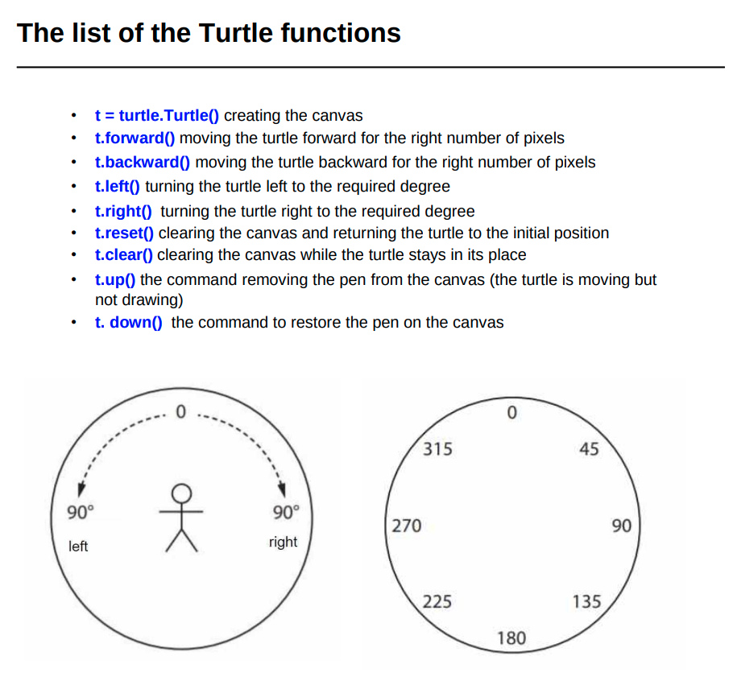
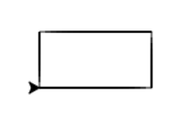
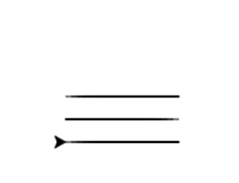

# Some of turtle functions   



**If we want our turtle to look like turtle we can use  `t.shape("turtle")`**

## Class Assignments

**To write a comment in Python you should start with a `#` symbol**  

**Example**:

```python
# This is a comment 
# This is also a comment
```

**Problem 1. Draw Rectangle with a turtle:**

**Code for it**

```python
import turtle

t = turtle.Turtle()  # creates a turtle for us, its name it t

# Bootom side of a shape:
t.forward(100) 
t.left(90) 
# Right side:
t.forward(50) 
t.left(90) 
# Top side:
t.forward(100) 
t.left(90) 
# Left side:
t.forward(50) 
t.left(90) 
#t.reset()
# Here you need to write code

```

**Result:**



**Hint for your home task (Problem 1 in a home task):**

You can use not `90` degrees angle but `60` , for example, to draw a triangle

**Problem 2. Draw Lines with a turtle**

**Code :**

```python
import turtle
t = turtle.Turtle()

t.backward(100)
# Says our turtle not to draw:
t.up()
t.right(90)
t.forward(20)
t.left(90)
t.down()
t.forward(100)
# Here you need to write code

t.right(90)  # Rotating our turtle
t.up()  # Stop drawing
t.forward(20)  # Moving forward to the bottom
t.left(90)  # Rotating turtle
t.down()  # Starts drawing again
t.backward(100)  # Moves Backwards
```

**Result:**



## Variables

**Variable** is a special cell (or I said "box") for storing one thing in it

**To create a variable we just write the name of it and the value we want to put into it**  

**Example:**

```python
teacher = "Dima"  # Variable with name Teacher and value "Dima"

print(teacher)  # prints the value of Teacher

print(teacher * 20)  # prints the value of Teacher 20 times

A = 10  # Variable with name A and value 10
B = 6  # Variable with name B and value 6
print(A + B)  # prints A + b

Teacher = "Dima" 
myTeacher = Teacher  # Variable that equals Teacher

print(Teacher)  # prints the value of Teacher
print(myTeacher)  # prints the value of myTeacher

klass = 8  # klass variable, value is 8
klass = klass # Doesn't change value

print(klass)  # Prints value

klass  = klass + 1 # Sets value to value + 1
print(klass)

klass = 8  # Sets value to 8
klass += 1  # Sets value to value + 1
print(klass)
```


Materials of school  <a href="https://kodland.org/">Kodland<a/>

