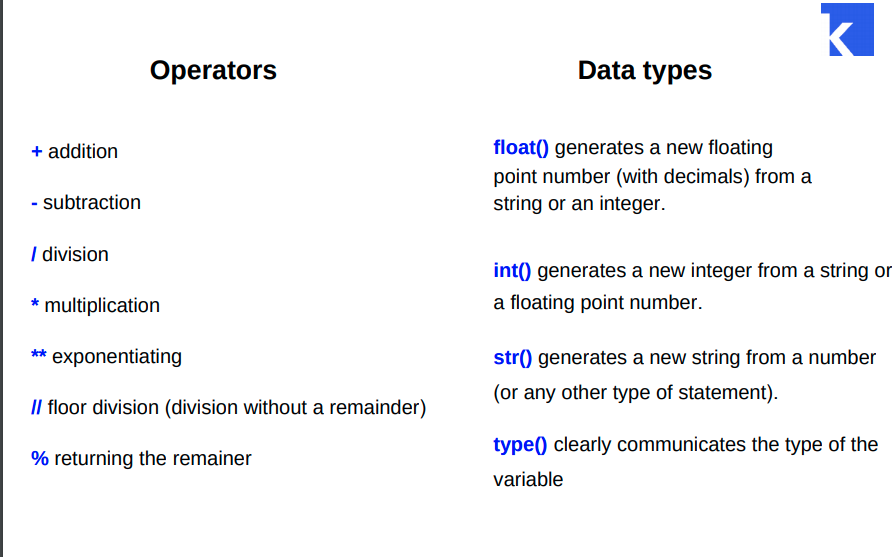

### Operations and Data types in Python 


### Assignments that we discussed on a lesson

#### 1. Order of  operations in Python

**Python knows that firstly comes `multiplication`, then `plus`**

```python
print(2 + 3 * 4)  # 14. Python will do multiplication firstly

print((2 + 3) * 4)  # 20  We have brackets, so plus would be the first operation
```


### 2. Count number of minutes in a week

```python
DaysPerWeek = 7 #  number of days in a week
HoursPerDay = 24 # number of hours in a day
MinutesPerHour = 60  # number of minutes in 1 hour

# We need to multiply everything )

print(DaysPerWeek * HoursPerDay * MinutesPerHour)  # the result
```

### 3. Count number of minutes in a week where one day lasts `26 hours`

**We will do the same thing as in the previous task, but use different value for the variable**

```python
DaysPerWeek = 7 #  number of days in a week
HoursPerDay = 26 # number of hours in a day
MinutesPerHour = 60  # number of minutes in 1 hour

print(DaysPerWeek * HoursPerDay * MinutesPerHour)  # the result
```

### 4. Operations with lines and numbers

**It is OK to do `line + line` and `line * number` **

**BUT it is not OK to do `line * line` and `line + number`**

```python
line1 = "Dima"  # my name
line2 = "FFFgjfdhgjhfdj"  # just a text

number1 = 8  # first number
number2 = 7  # second number

print(line1 + line2)  # line + line -> OK
# print(line1 * line2)  # line * line -> ERROR

# print(line1 + number2)  # -> line + number -> ERROR

print(line2 * number1)  # line * number -> OK
```

### 5.  Print `I have got it` message using variables

```python
line1 = "I have "  # first variable
line2 = "got it!"  # second variable
number = 9  # number of times we want to print our message

print((line1 + line2) * number)  # prints the message several times
```

### 6. Print penguins   

**We need to use `line * number` in order to print our penguins lots of times )**

```python
a = '   _~_    '
b = '  (o o)   '
c = ' /  V  \  '
d = '/(  _  )\ '
e = '  ^^ ^^   '

count = 7  # number of pinguins

print(a * count)  # top part of penguins
print(b * count)
print(c * count)  # middle part of penguins
print(d * count)
print(e * count)  # legs of our penguins
```

### 7. Some more operations with variables

**We know about `+` and `*` (multiplication), but there are also `/`, which is `dividing` and `//` - also dividing, but gives only natural part of the result and `%`, which gives remainder of division**.

```python
number = 53


a = 16
b = 3
print(11 % 3)  # 2; remainder of a division
#  +; *; / - dividing, // - integer of the result, % - remainer of dividing  
# 10 apples; 3 persons - example to illustrate operations
```




