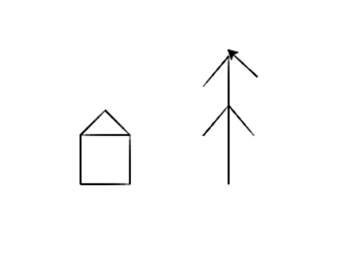

### Творческие задания с рисованием и с `input()`

#### 1. Спросить у пользователя вопросы и вывести смешное сообщение, используя его ответы на вопросы.

**`Мое решение`:**   **Вам лучше написать свои вопросы и свою историю ** 

```python
name = input("Введи свое имя ")  # Спрашиваем имя
age = int(input("Введи свой возраст "))  # Спрашиваем возраст
color = input("Введи любимый цвет ")  # Цвет
city = input("Введи название своего города ")  # Город
friend = input("Введи имя своего лучшего друга ")  # Друг
animal = input("Введи любимое животное ")  # Животное
car = input("Напишите марку машины")  # Машина
street = input("Назовите улицу")  # Улица
bullets = int(input("Сколько пуль в магазине пистолета"))  # Число пуль в пистолете


print()  # Выводит пустую строку для отступа
print("Внимание разыскиваются опасные преступники ", name, " и ", friend, " они похитили 3", 
" килограмма золота и скрылись в неизвестном направлении. По их следу идет лучшая ", animal, 
" ищейка. Последний раз преступников видели в городе ", city, ". Они сели в ", color, car,
"и уехали на юг.", "Они были вороужены и в магазине пистолета было", bullets, "пуль",
"Последний раз их видели на", street, "улице",
" Всех кто обладает какой-либо информацией ",
"будут вознаграждены и получат ", age, " золотых монет")  # Воводим наше длинное сообщение
      
```

#### 2.  Нужно придумать интересный рисунок и нарисовать его черепашкой, я нарисовал домик и дерево. Вы рисуете что-то другое. ИСПОЛЬЗУЙТЕ ПЕРЕМЕННЫЕ 

```python
import turtle

t = turtle.Turtle()

# Давайте вспомним команды для черепашки:
# right() - повернуть черепаху вправо;
# forward(), backward() - перемещать черепаху вперед, назад. 

# up(), убирает перо с холста(отключить рисование)
# С помощью команды down() рисование можно снова включить.
# t.color("red") - изменить цвет рисования.
# t.speed(10) - изменить скорость рисования.

t.forward(50) 
t.left(90) 
t.forward(50) 
t.left(90) 
t.forward(50) 
t.left(90) 
t.forward(50) 
t.left(180) 

t.forward(50)

t.right(45)
t.forward(35.35533905932738)
t.right(90)
t.forward(35.35533905932738)

t.up()
t.right(45)
t.forward(50)

t.left(90)
t.forward(100)
t.down()

vetka = 40  # Длина ветки

t.left(90)
t.forward(130)
t.left(140)
t.forward(vetka)
t.up()
t.left(40)
t.forward(50)
t.down()
t.right(40)
t.backward(vetka)
t.left(80)
t.forward(vetka)
t.up()
t.left(137)
t.forward(60)
t.left(50)
t.down()
t.forward(vetka)
```

 **Результат:**

