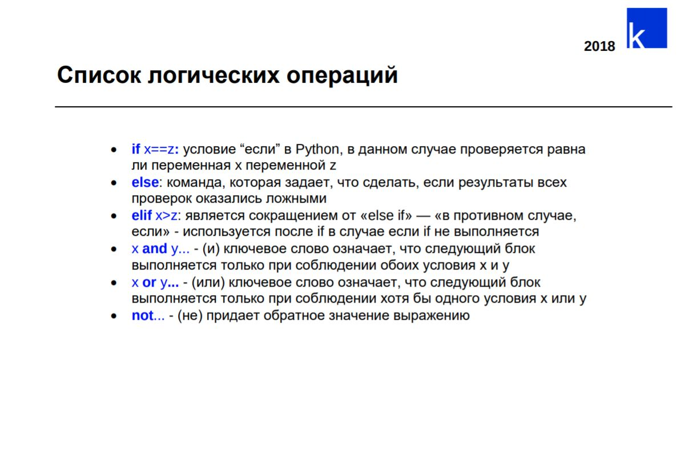

### Условные операторы в Python



### Задачки, которые решали в классе 

#### 1. Вывести, можно ли человеку получить права по его возрасту

```python

age = int(input("Введите возраст: "))  # считываем возраст

if age >= 18:  # если возраст больше либо равен 18
    print("Можно получить права")
if age < 18:  # Возраст меньше 18
    print("Нельзя получить права")


if age != 20:  # Если возраст не равен 20
    print("Ваш возраст не 20 лет")
if age == 20:  # Если возраст равен 20
    print("Ваш возраст 20 лет")
```


#### 2. Как первая задачка, только теперь используем `else`

```python
answer = int(input("Сколько вам лет? "))  # считываем возраст

if answer >= 18:  # Если возраст больше или равен 18
    print("Можно получить")
else: # Иначе
    print("Нельзя получить")
```

#### 3. Вывести можно ли переходить дорогу по цвету светофора

```python
answer = input("Какой цвет горит на светофоре?")  # считываем цвет
if answer == "Зелёный":  # Если цвет зеленый
    print("Можно переходить дорогу")
if answer == "Жёлтый":  # Если цвет желтый
    print("Беги ты ещё успеешь")
if answer == "Красный":  # Если цвет красный
    print("Сейчас переходить дорогу нельзя")
```

#### 4. Вывести что надевать по ответам на вопросы про погоду

```python
cold = input("На улице холодно?")  # считываем ответ
rain = input("На улице идет дождь?")  # считываем ответ
hot = input("На улице жарко?")  # считываем ответ

if cold == "да":  # Если ответ про холод был да
    print("Надевайте теплую шапку")
elif rain == "да":  # Если ответ про дождь был да
    print("Берите с собой зонт")
elif hot == "да":  # Если ответ про жарко был да
    print("Надевайте кепку")
```

#### 5. По температуре вывести погоду

```python
temp = int(input("Какая сейчас температура воздуха? "))  # считываем температуру
if temp <= 0:  # Если меньше или равно 0
    print("Очень холодно") 
elif 13 < temp < 18: # Больше 13 и меньше 18
    print("Прохладно")
elif 19 < temp < 25:  # Больше 19 и меньше 25
    print("Тепло")
elif 26 < temp < 32:  # Больше 26 и меньше 32
    print("Жарко")
elif temp > 32:  # Больше 32
    print("Очень жарко")
```

#### 6. Пользователь вводит Q или q. Вывести что он ввел

```python
answer = input("Введите Q или q")  # считываем что ввели

if answer == "q":  # Если ввели q
    print("Пользователь ввел q")
elif answer == "Q":  # Если ввели Q
    print("Пользователь ввел Q")
else: # Во всех других случаях
    print("Вы ввели что-то другое")
```

