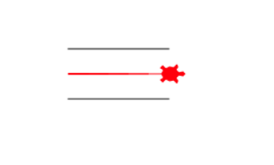
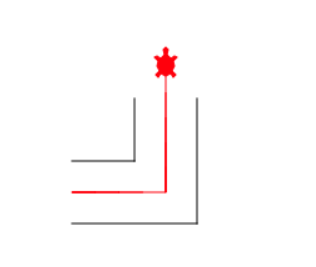
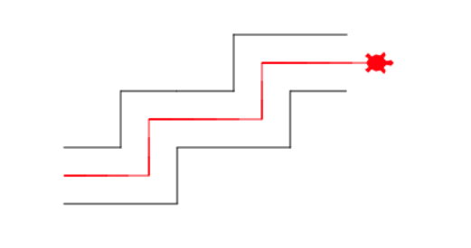
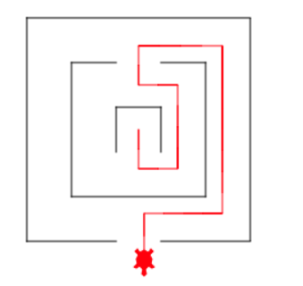

# Мастер-класс по Python

## 1. Hello world. 

## Программа,  которая выводит "Hello world !" на экран.

Для вывода на экран в Python используется команда **`print()`**

Для написания комментария в Python используется символ  **`#`**

Ниже приведен код с комментариями, который выводит Hello world:

```python
# это комментарий, он не исполняется, это просто текст
# комментарии нужны, чтобы пояснять код

# Программа для вывода Hello world:

print('Hello world!')  # выводит Hello world
```


## 2. Вычисления в Python

Выведем на экран сумму двух чисел, например,  **`5 + 3`** и произведение двух чисел

```python
# Сумма двух чисел:
print(5 + 3)  # 8

# Произведение двух чисел:
print(5 * 3)  # 15

# Что-то длинное, очень длинное
print(123456789123456789 * 123456789)
```

## 3. Задачка на вычисления

Условие: 

Программист Василий зарабатывает **350 тысяч** рублей в месяц. За месяц он обычно пишет **14** больших программ. В каждой программе у него **500** строк кода, а в каждой строке в среднем **12** символов. 

В декабре он получил премию, равную **половине** его обычной **зарплаты**. 

Сколько Василий получал за один использованный символ в декабре?

Решение:

```python
# Решение задачи

# Делим зарплату на общее число символов в декабре
print((350000 / 2) / (14 * 500 * 12))
```

## 4. Черепашка-1

```python
# Этот код рисует для вашей черепахи лабиринт. 
# Не трогайте его ни в коем случае!
# Его написал за Вас Kodland :)

import turtle

t = turtle.Turtle()
t.shape('turtle')
t.speed(100)
t.forward(100)
t.up()
t.right(90)
t.forward(50)
t.down()
t.right(90)
t.forward(100)
t.up()
t.right(90)
t.forward(25)
t.down()
t.right(90)
t.color('red')
t.speed(10)


# Ниже напишите код для прохождения лабиринта
# Ваш код:
t.forward(100)  # Отправляем черепашку прямо на 100 единиц

```

Результат:



## 5. Черепашка-2

```python
# Этот код рисует для вашей черепахи лабиринт. 
# Не трогайте его ни в коем случае!

import turtle

t = turtle.Turtle()
t.shape('turtle')
t.speed(100)
t.forward(50)
t.left(90)
t.forward(50)
t.up()
t.right(90)
t.forward(50)
t.right(90)
t.down()
t.forward(100)
t.right(90)
t.forward(100)
t.up()
t.right(90)
t.forward(25)
t.right(90)
t.down()
t.color('red')
t.speed(10)

# Ниже напишите код для прохождения лабиринта
# Ваш код:

t.forward(75)  # Идем прямо на 75 
t.left(90)  # Поворачиваем в левую сторону на 90 градусов
t.forward(100)  # Идем прямо на 100

```

Результат:



## 6. Черепашка-3

```python
# Этот код рисует для вашей черепахи лабиринт. 
# Не трогайте его ни в коем случае!

import turtle

t = turtle.Turtle()
t.shape('turtle')
t.speed(100)
t.forward(50)
t.left(90)
t.forward(50)
t.right(90)
t.forward(100)
t.up()
t.right(90)
t.forward(50)
t.right(90)
t.down()
t.forward(50)
t.left(90)
t.forward(50)
t.right(90)
t.forward(100)
t.left(90)
t.forward(50)
t.right(90)
t.forward(100)
t.right(90)
t.up()
t.forward(100)
t.right(90)
t.forward(100)
t.right(180)
t.down()
t.forward(50)
t.left(90)
t.forward(50)
t.right(90)
t.forward(50)
t.up()
t.left(90)
t.forward(25)
t.left(90)
t.down()
t.color('red')
t.speed(10)

# Ниже напишите код для прохождения лабиринта
t.forward(75)  # Идем прямо на 75
t.left(90)  # Поворачиваем влево на 90 градусов
t.forward(50)  # Идем прямо на 50
t.right(90)  # Поворачиваем направо на 90 градусов
t.forward(100)  # Идем прямо на 100 
t.left(90)  # Поворачиваем налево на 90 градусов
t.forward(50)  # Идем на 50 прямо
t.right(90)  # Поворачиваем на 90 градусов влево
t.forward(100)  # Идем еще на 100 прямо
```

Результат



## 7. Черепаха-4

```python
# Этот код рисует для вашей черепахи лабиринт. 
# Не трогайте его ни в коем случае!

import turtle

t = turtle.Turtle()
t.shape('turtle')
t.up()
t.speed(100)
t.left(180)
t.forward(200)
t.right(90)
t.forward(100)
t.down()
t.right(90)
t.forward(200)
t.right(90)
t.forward(200)
t.right(90)
t.forward(80)
t.up()
t.forward(40)
t.down()
t.forward(80)
t.right(90)
t.forward(200)
t.right(90)
t.up()
t.forward(40)
t.right(90)
t.forward(40)
t.down()
t.forward(120)
t.left(90)
t.forward(120)
t.left(90)
t.forward(120)
t.left(90)
t.forward(40)
t.up()
t.forward(40)
t.down()
t.forward(40)
t.up()
t.left(90)
t.forward(40)
t.left(90)
t.forward(40)
t.down()
t.forward(40)
t.right(90)
t.forward(40)
t.right(90)
t.up()
t.forward(40)
t.down()
t.right(90)
t.forward(40)
t.up()
t.right(90)
t.forward(20)
t.right(90)
t.forward(20)
t.down()
t.color('red')
t.speed(10)

# Ниже напишите код для прохождения лабиринта
# Ваш код:

t.forward(35)  # Идем прямо на 35
t.left(90)  # Поворачиваем налево
t.forward(35)  # Опять прямо на 35
t.left(90)  # Поворачиваем на 90 градусов налево
t.forward(75)  # Идем прямо на 75
t.left(90)  # Поворот налево
t.forward(35)  # Прямо на 35
t.right(90)  # Поворачиваем направо на 90 градусов
t.forward(35)  # Идем прямо на 35
t.right(90)  # Направо
t.forward(75)  # Прямо на 75
t.right(90)  # Направо
t.forward(150)  # Прямо на 150
t.right(90)  # Направо
t.forward(70)  # Идем прямо на 70
t.left(90)  # Поворачиваем налево на 90
t.forward(40)  # Идем прямо на 40

```

Результат




#### Материалы школы  <a href="https://kodland.org/">Kodland<a/>