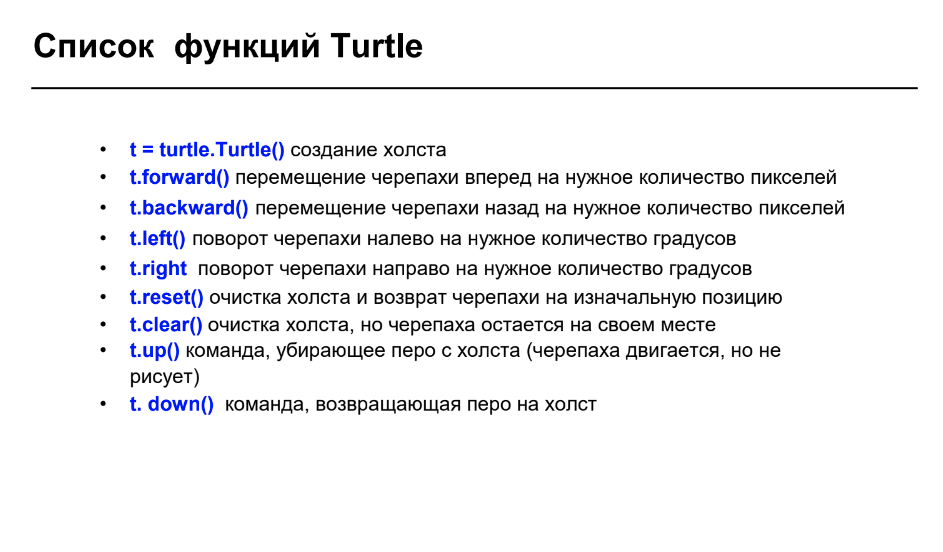
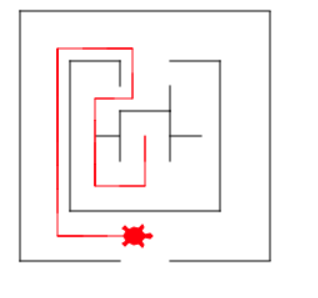

# Основные функции Черепашки (turtle)   



**Чтобы Черепашка выглядела как черепеха, а не как стрелочка можно написать `t.shape("turtle")`**

### Рисуем черепахой квадрат, задача 3 из классной: (в домашке берем не 90, а 60 и три стороны и будет треугольник)

```python	
import turtle

t = turtle.Turtle()

# Нижняя сторона
t.forward(50) 
# Поворот налево
t.left(90) 
# Рисуем боковую правую сторону
t.forward(50) 
# Поворачиваем налево
t.left(90) 
# Рисуем верхнюю
t.forward(50) 
# Поворачиваем налево
t.left(90) 
# Рисуем боковую левую
t.forward(50) 
t.left(90) 
```


### Используем переменные

```python
# Имя учителя
teacher = "Дима"
#print("Моего учителя зовут")
print(teacher)

# Умножаем строку на число и получаем строку много раз
print(teacher * 10)

# Рассчеты с помощью переменных
A = 5 # первая переменная
a = 10
B = 6 # вторая переменная

# сумма чисел:
print(A + B)  # Выводим сумму
# произведение:
print(A * B) # Выводим произведение

# Еще возможности переменных
money = 1000  # переменная, запишем в нее число
money = money # присвоим ей ее же, ничего не будет
money = money + 100  # Присвоим ей ее значение + 100
money += 100 # Тоже самое, что выше на 1 строку можно делать и так)

print(money)  # Выводим результат
```


Материалы школы  <a href="https://kodland.org/">Kodland<a/>

### Квадрат, но теперь используем переменные (домашку тоже лучше с переменными)

```python
import turtle

t = turtle.Turtle()

# зададим значения переменным для удобства использования в дальнейшем
Length = 100  # длина
Height = 50  # высота
Angle = 90  # угол

# А теперь будем рисовать используя переменные а не просто числа :)
t.forward(Length) 
t.left(Angle) 
t.forward(Height) 
t.left(Angle) 
t.forward(Length) 
t.left(Angle) 
t.forward(Height) 
t.left(Angle) 

# Попробуйте поменять значения у переменных 
# и посмотреть как изменится картинка
```


### Проходим лабиринт черепашкой

```python
# Этот код рисует для вашей черепахи лабиринт. 
# Не трогайте его ни в коем случае!

import turtle
t = turtle.Turtle()
t.shape("turtle")
t.up()
t.speed(100)
t.left(180)
t.forward(200)
t.right(90)
t.forward(100)
t.down()
t.right(90)
t.forward(200)
t.right(90)
t.forward(200)
t.right(90)
t.forward(80)
t.up()
t.forward(40)
t.down()
t.forward(80)
t.right(90)
t.forward(200)
t.right(90)
t.up()
t.forward(40)
t.right(90)
t.forward(40)
t.down()
t.forward(120)
t.left(90)
t.forward(120)
t.left(90)
t.forward(120)
t.left(90)
t.forward(40)
t.up()
t.forward(40)
t.down()
t.forward(40)
t.up()
t.left(90)
t.forward(40)
t.left(90)
t.forward(40)
t.down()
t.forward(40)
t.right(90)
t.forward(40)
t.right(90)
t.up()
t.forward(40)
t.down()
t.right(90)
t.forward(40)
t.up()
t.right(90)
t.forward(20)
t.right(90)
t.forward(20)
t.right(90)
t.forward(20)
t.down()
t.forward(20)
t.up()
t.right(90)
t.forward(40)
t.right(90)
t.forward(20)
t.left(90)
t.down()
t.forward(20)
t.up()
t.right(90)
t.forward(40)
t.right(90)
t.forward(20)
t.down()
t.forward(20)
t.up()
t.forward(20)
t.left(90)
t.down()
t.forward(25)
t.up()
t.left(180)
t.forward(45)
t.left(90)
t.down()
t.color("red")
t.speed(10)

# Ниже напишите код для прохождения лабиринта

# Пишем движения для нашей черепашки
t.forward(40)
t.right(90)
t.forward(40)
t.right(90)
t.forward(70)
t.right(90)
t.forward(30)
t.left(90)
t.forward(40)
t.left(90)
t.forward(60)
t.left(90)
t.forward(150)
t.left(90)
t.forward(60)
```

**Результат:**



## Рекомендации по домашке:

- **Делайте домашку!!! Если не получается, то пишем мне**
- Сначала можно сделать без переменных, просто числами
- Потом попробуйте использовать переменные
- Создайте переменные, определите их значениями, которые вам нужны и используйте вместо просто чисел
- Пишите коментарии к своему коду

