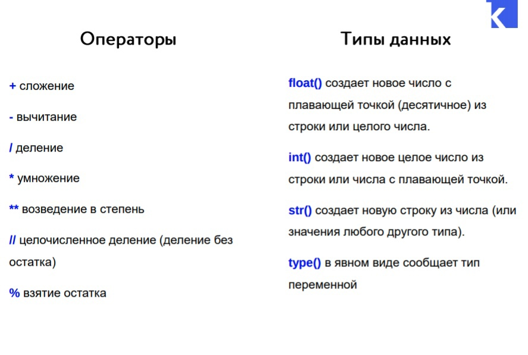

## Переменные и операции с ними. Типы данных в Python

  

##  Задачи, которые разбирали в классе

1. **Найти число минут в неделе:**

   ```python
   DaysPerWeek = 7 # число дней в неделе
   HoursPerDay = 24 # число часов в дне, можно менять это значение для других задач
   MinutesPerHour = 60 # число минут в часе
   
   print(MinutesPerHour * HoursPerDay * DaysPerWeek) # перемножаем это все и выводим на экран
   ```

2.  **Операции со строками и числами**

   ```python
   stroka1 = "hello world"  # строка 1
   print(type(stroka1))  # выведет тип переменной, тип str
   stroka2 = "Dima"  # строка 2
   number = 100  # переменная, номер
   print(type(number))  # Выводит тип переменной number, тип int
   
   print(stroka1 + stroka2) # Выводит сумму строк(склеивает их)
   print(stroka1 * number) # Выводит нашу строку несколько раз
   print(stroka2 + number) # Выдаст ошибку, нельзя к строке прибавлять число
   print(stroka1 * stroka2)  # Выдаст ошибку, нельзя умножать строку на строку
   ```

3. **Нужно с помощью переменных вывести сообщение**

   ```python
   stroka1 = "У меня"  # переменная, в которой записана строка
   stroka2 = "получилось!" #вторая переменная, в которой записана строка
   probel = " " # переменная с пробелом
   print(stroka1 + probel + stroka2)  # складываем строку + строку с пробелом + строку
   ```

   

4. **Есть пингвинчик, нужно добавить ему друзей**  

```python
a = '   _~_    '
b = '  (o o)   '
c = ' /  V  \  '
d = '/(  _  )\ '
e = '  ^^ ^^   '

count = 5  # число пингвинов
print(a * count)  # выводим верхнюю часть пингвина 5 раз
print(b * count)  # выводим часть пониже опять 5 раз
print(c * count)  # выводим часть еще пониже опять 5 раз
print(d * count)  # выводим предпоследнюю часть опять 5 раз
print(e * count)  # выводим последнюю часть опять 5 раз
```

5. **В переменных хранятся имя и возраст. Нужно вывести сообщение с ними**

Если в `print()` написать несколько параметров через запятую, **то он выведит их все через пробел**

```python
name = "Вася"  # имя
age = 14  # возраст

print("Меня зовут", name, "и мне", age, "лет")  # даем принту несколько параметров, он выводит их все через пробел
```

6. **Дано двухзначное число, нужно вывести первую его цифру, затем вторую его цифру. Это важная задача, чтобы сделать доп. задание!**

```python
number = 95  # наше число
print(number)  # напечатаем наше число
# number // 10 - первая цифра нашего числа
# number % 10 - последняя цифра нашего числа
print(number // 10, number % 10)  # выводим обе цифры через вробел

```

